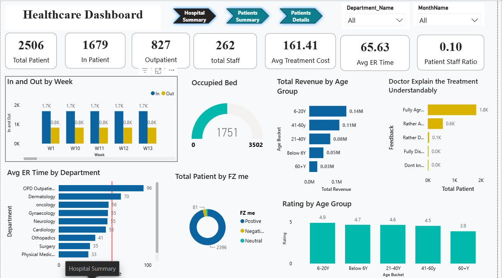
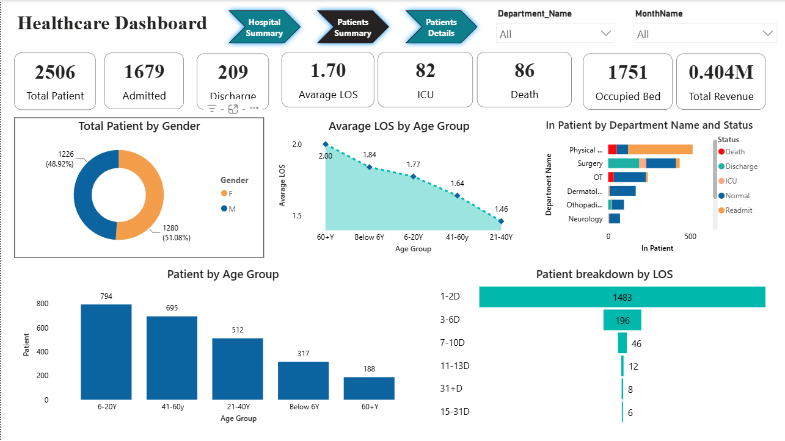

# 🏥 Healthcare Operations & Patient Analytics Dashboard

An interactive, multi-page Power BI dashboard built to help hospital management teams monitor patient activity, resource utilization, and departmental performance — enabling faster, data-driven operational decisions.

---

## 📌 Business Objective

Hospital administrators need a centralized view of patient flow and resource allocation to reduce bottlenecks and improve care delivery. This dashboard was built to answer:

- How are patient visits and revenue distributed across age groups and departments?
- Which departments/hospitals face the highest bed and staff utilization?
- Where are patients experiencing the longest appointment waiting times?
- How satisfied are patients with prescriptions and overall hospital service?

---

## 🗂️ Dataset

Source: `Hospital Health Care Management Data set.xlsx`

A relational dataset spanning multiple linked tables:

| Table | Description |
|---|---|
| Patient Details | Patient visits, demographics, age groups, appointment data |
| Bed Details | Bed availability and occupancy by department |
| Staff Details | Staff allocation and department assignment |
| Department | Department-level reference data |

---

## 🛠️ Tech Stack

- **Power BI Desktop** — report authoring and data modeling
- **Power Query (M)** — data cleaning and transformation (merge, remove, trim, type conversion)
- **DAX** — KPI measures and calculated logic
- **Data Modeling** — star-schema-style relationships between fact and dimension tables

---

## ⚙️ Key Features

- **Two-page report**: Hospital Summary + Patients Summary
- **KPI cards** for at-a-glance metrics (visits, revenue, wait times, satisfaction)
- **Drill-down & drill-through** for department → patient-level detail
- **Filters and slicers** for dynamic segmentation by age group, department, and hospital
- **Button-based navigation** between report pages
- Custom visuals for enhanced UX (rotating card, scroller)

---

## 📊 Dashboard Preview

### Hospital Summary
_Bed occupancy, staff allocation, and department-level performance._



### Patients Summary
_Patient visits, revenue by age group, appointment wait times, and service feedback._



---

## 🔍 Key Insights

> _To be filled in after analysis — e.g. highest-revenue age group, department with longest average wait time, occupancy trends, satisfaction drivers._

- Insight 1:
- Insight 2:
- Insight 3:

---

## 🚀 How to Run

1. Clone this repository
   ```bash
   git clone https://github.com/<your-username>/healthcare-ops-analytics-powerbi.git
   ```
2. Open `Healthcare Dashboard.pbix` in **Power BI Desktop**
3. If prompted, update the data source path to point to the local `.xlsx` file
4. Explore the report — use the navigation buttons to switch between pages, and click into any KPI card for drill-through detail

---

## 👤 Author

**Mohd Farhan Abbas**
[LinkedIn](#) · [GitHub](#) · [Portfolio](#)
